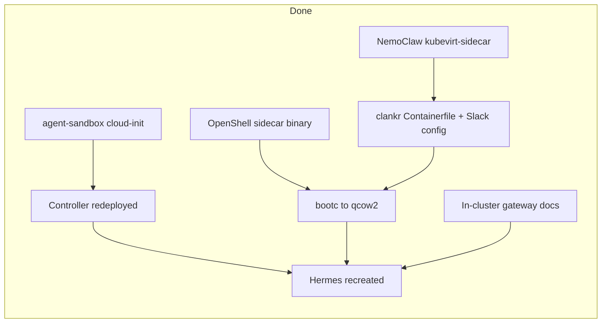

# KubeVirt VM Hermes: Handoff + Bake Results

## Summary

KubeVirt VM support for the agent-sandbox controller so Hermes (NemoClaw) runs in a VM instead of a Pod. Full gateway integration works.

**As of 2026-07-10 (evening) — BAKE COMPLETE:** Two-service sidecar topology baked into controller + bootc image. Clean Hermes recreate verified (Slack Socket Mode + Vertex inference). Primary contact channel is **Slack**. Discord disabled in image. Signal deferred (SSRF).

**As of 2026-07-10 (late) — BRANCHES ON FORKS:** Controller + OpenShell sidecar work pushed to `shanemcd` forks (no upstream PRs yet). Early standalone `openshell-driver-kubevirt` POC dropped from the OpenShell branch; approach is an option on the existing Kubernetes driver + `--mode=network` sidecar runtime.

**As of 2026-07-10 (cleanup) — LEAN IMAGE + NEMOCLAW BRANCH:** In-image sed/python patches removed. VM/sibling-supervisor support lives on [`shanemcd/NemoClaw` `kubevirt-sidecar`](https://github.com/shanemcd/NemoClaw/tree/kubevirt-sidecar) (`NEMOCLAW_VM_SIDECAR=1` / `nemoclaw-start-vm`). Bootc image is Hermes + ddgs only (no rust, build toolchain, or extra CLIs).

**As of 2026-07-10 (late) — HERMES ≥0.18 INFERENCE FIX:** `provider: anthropic` + `base_url: https://inference.local` is ignored by Hermes (`_anthropic_base_url_override_ok`); it falls back to `api.anthropic.com` (DENIED by OpenShell). Live config must use `provider: custom`, `base_url: https://inference.local`, `api_key: sk-OPENSHELL-PROXY-REWRITE`, `api_mode: anthropic_messages`. Hot-fixing config/`.env` requires regenerating hashes in **sha256sum format** via `update-config-hashes.py` (wrong format crash-loops with `Config integrity check FAILED`).

## Repositories involved

| Repo | Fork / branch | What changed |
|------|---------------|-------------|
| `kubernetes-sigs/agent-sandbox` | [`shanemcd/agent-sandbox` `kubevirt-backend`](https://github.com/shanemcd/agent-sandbox/tree/kubevirt-backend) | Squashed: `runtimeBackend: VirtualMachine` + cloud-init two-service topology when `OPENSHELL_SANDBOX_COMMAND` is set. CRDs regenerated via `make fix-go-generate`. |
| `NVIDIA/OpenShell` | [`shanemcd/OpenShell` `kubevirt-sidecar`](https://github.com/shanemcd/OpenShell/tree/kubevirt-sidecar) | Fork parent is **NVIDIA** (not clankrshq). Single commit: sidecar runtime + K8s driver `runtimeBackend` / `sandboxCommand` + Helm. Old `kubevirt-driver` branch still has the discarded standalone-driver POC — prefer `kubevirt-sidecar`. |
| `NVIDIA/NemoClaw` | [`shanemcd/NemoClaw` `kubevirt-sidecar`](https://github.com/shanemcd/NemoClaw/tree/kubevirt-sidecar) | Sibling-supervisor identity/readiness + `nemoclaw-start-vm` (`NEMOCLAW_VM_SIDECAR=1`). SHA `8700f72`. |
| `shanemcd/clankr` | (working tree, unpushed) | Lean `Containerfile.kubevirt` (Hermes+ddgs), Slack-only config, this doc |

## Bake outcomes (2026-07-10 evening)

| Layer | Result |
|-------|--------|
| OpenShell `sidecar_runtime` | Baked into Hermes disk; source on fork branch `kubevirt-sidecar` |
| agent-sandbox cloud-init | Two-service topology on CRC; source squashed on fork `kubevirt-backend` |
| NemoClaw VM entrypoint | `nemoclaw-start-vm` from `shanemcd/NemoClaw` `kubevirt-sidecar` (no Containerfile patches) |
| clankr bootc disk | Hermes + ddgs only; Slack-only config; `usermod -aG sandbox gateway` |
| Live Hermes VM | Lean recreate + hot-fix: Slack Socket Mode; model `custom`→`inference.local`; **no `/tmp` hot-patches** |
| Gateway docs | In-cluster bootstrap in `PROVIDERS.md`, `KUBEVIRT_POC.md`, this doc |



## Architecture

### How it works in containers (the reference)

```
Pod:
  nemoclaw-start (PID 1, root)          ← container entrypoint
    └─ sets up configs, ownership
    └─ creates 'gateway' user
    └─ drops to sandbox user
    └─ runs hermes gateway

  openshell-sandbox (sidecar container)  ← separate process
    └─ creates netns + proxy
    └─ SSH relay
    └─ does NOT manage nemoclaw's process
```

Key point: the supervisor and nemoclaw-start are **peers**, not parent-child. The supervisor never touches `/sandbox` or runs `nemoclaw-start`.

### How it works in the VM (baked)

```
VM (systemd):
  openshell-sandbox --mode=network       ← networking only, no process mgmt
    └─ creates netns (sandbox-XXXX) + proxy at 10.200.0.1:3128
    └─ publishes /run/openshell/netns + provider.env
    └─ watches /run/openshell/entrypoint.pid for proxy identity binding
    └─ SSH relay for gateway exec
    └─ does NOT chown /sandbox, does NOT exec any command

  sandbox-workload.service               ← /etc/openshell/sandbox-workload-start
    └─ waits for /run/openshell/{netns,provider.env}
    └─ sources provider.env (credential placeholders)
    └─ restores root:sandbox 1775 on /sandbox (tmpfs overlay resets this)
    └─ SSL_CERT_FILE=/etc/openshell-tls/ca-bundle.pem
    └─ nsenter --net=<netns>
    └─ writes $$ to /run/openshell/entrypoint.pid
    └─ exec nemoclaw-start-vm as root (NemoClaw drops to gateway/sandbox)
      └─ hermes gateway run
```

This mirrors the container sidecar pattern. The two-service split was necessary because:
- The supervisor's "combined" mode (`--mode=network,process`) chowns `/sandbox` recursively, wiping NemoClaw's root-owned config posture
- The supervisor refuses to run commands as UID 0 (hardcoded `[1000, 2000000000]` range)
- NemoClaw's startup script expects root-level setup that the supervisor can't provide

### Where credentials live (important)

The OpenShell **gateway is not on the VM**. Secrets live in the gateway object store. The VM only sees placeholders; the supervisor proxy rewrites them at egress.

| Gateway | Endpoint | Role |
|---------|----------|------|
| **In-cluster** (CRC) | `http://openshell.openshell.svc.cluster.local:8080` | What the Hermes VM uses (`OPENSHELL_ENDPOINT`) |
| **Local `tot`** | `https://tot:8080` | Host CLI default (`openshell gateway list` → `* tot`) |

These are **separate stores**. Configuring providers/inference on `tot` does **not** affect the VM. Always target the in-cluster gateway:

```bash
oc port-forward -n openshell svc/openshell 18080:8080
openshell provider list --gateway-endpoint http://127.0.0.1:18080
openshell inference get --gateway-endpoint http://127.0.0.1:18080
```

## Root cause analysis (2026-07-10)

### Morning: proxy / entrypoint identity

| Suspected issue | Actual finding |
|-----------------|----------------|
| Proxy unreachable from netns | Proxy **was** reachable (`curl` → 400 from inside netns) |
| Stale netns from `ls -t` | Real, but not the blocker once `/run/openshell/netns` is published |
| Missing `http_proxy` | Env was already set by nemoclaw-start |
| Credential placeholders not in `.env` | **Real** — tokens are injected into **process env**, not baked into `.env`. Network-only mode never spawned a child |
| Platforms fail with 403 | **Real** — `entrypoint process not yet spawned`; identity binding needs a PID **inside the sandbox netns** |

**Fix:** OpenShell `--mode=network` publishes `/run/openshell/{netns,provider.env}`, watches `entrypoint.pid`; workload sources them, trusts MITM CA, enters netns, writes PID. (Morning used `/tmp/openshell-sandbox.new`; now baked into the image.)

### Afternoon: Slack up, inference 503

```text
HTTP 503: {'error': 'cluster inference is not configured',
           'hint': 'run: openshell cluster inference set --help'}
```

| Suspected issue | Actual finding |
|-----------------|----------------|
| Inference not set at all | Set on **`tot` only** |
| VM gateway missing routes | Supervisor fetched `route_count:0` from **in-cluster** gateway |
| Wrong Vertex project | ADC `quota_project_id` wrong; correct is `itpc-gcp-hcm-pe-eng-claude` |

**Fix (in-cluster gateway via port-forward):**

```bash
oc port-forward -n openshell svc/openshell 18080:8080

openshell provider create --gateway-endpoint http://127.0.0.1:18080 \
  --name vertex-prod --type google-vertex-ai --from-gcloud-adc \
  --config VERTEX_AI_PROJECT_ID=itpc-gcp-hcm-pe-eng-claude \
  --config VERTEX_AI_REGION=global

openshell inference set --gateway-endpoint http://127.0.0.1:18080 \
  --provider vertex-prod --model claude-opus-4-6
```

### Evening bake lessons

1. **entrypoint.pid `$$`**: use wrapper under `/etc/openshell/` (bootc `/usr` is read-only; systemd `$` escaping is fragile)
2. **`/sandbox` root:root after tmpfs**: NemoClaw treats this as an orphaned seal — re-`chown root:sandbox` + `chmod 1775`
3. **bootc UID remap**: normalize `.hermes` mutable trees to `sandbox:sandbox`, re-lock trust anchors (`config.yaml`, `.config-hash`, `SOUL.md`)
4. **gateway ∈ sandbox group** required to read `.env` / locks (`usermod -aG sandbox gateway`)
5. **first-boot Slack race**: source `provider.env` in the wrapper; don't rely only on systemd `EnvironmentFile` timing

### Operational footgun: NemoClaw config hashes

Editing `/sandbox/.hermes/config.yaml` or `.env` on the live VM **without** regenerating hashes crash-loops the workload (`Config integrity check FAILED` / `HERMES_MCP_CONFIG_DRIFT`). Use `update-config-hashes.py` (both `/sandbox/.hermes/.config-hash` and `/etc/nemoclaw/hermes.config-hash`) — format is `sha256sum` lines (`<digest>  <abs-path>`), not `config: <digest>`. Prefer baking changes into the image.

### Operational footgun: Hermes ≥0.18 + OpenShell inference

Do **not** set `model.provider: anthropic` with `base_url: https://inference.local`. Hermes drops the override and calls `api.anthropic.com`, which OpenShell denies → Slack “model provider failed after retries”. Use `provider: custom` + `api_mode: anthropic_messages` + literal `sk-OPENSHELL-PROXY-REWRITE` (see `hermes-config.py` / `hermes.env`).

Also clear `providers` / `custom_providers` entries named `custom`. A leftover block (e.g. Nemotron + `chat_completions`) hijacks `resolve_runtime_provider()` and ignores `model.api_mode`, producing `POST /v1/chat/completions` / `/api/show` instead of `/v1/messages` → `no compatible inference route available`.

## Current live outcomes

| Platform / path | Status | Notes |
|-----------------|--------|-------|
| Slack | **Working** | Socket Mode through proxy; primary contact channel |
| Inference (`inference.local`) | **Working** | `provider: custom` + `api_mode: anthropic_messages`; no named `providers.custom` hijack; in-cluster `vertex-prod` → Claude Opus |
| Discord | **Disabled** in image | Token rotation is separate if re-enabled |
| Signal | **Deferred** | SSRF rejects `host.containers.internal` |
| Atlassian MCP | ALLOWED | Proxy allows |
| GitHub | ALLOWED | Downloads work through proxy |

## Still open

#### Signal on VMs (deferred)

`SIGNAL_HTTP_URL=http://host.containers.internal:8081` is Podman-specific and blocked by OpenShell SSRF. Point Signal at a routable signal-cli endpoint (or run signal-cli in-cluster).

#### Discord token (low priority)

Not a VM wiring bug. Image disables Discord. Rotate `DISCORD_BOT_TOKEN` on the **in-cluster** gateway only if Discord is re-enabled.

#### Commits / PRs

| Repo | Status |
|------|--------|
| agent-sandbox | Fork branch pushed + squashed. **No upstream PR yet.** |
| OpenShell | Fork re-parented to NVIDIA; clean branch `kubevirt-sidecar` pushed. **No upstream PR yet.** Discard `kubevirt-driver` (standalone POC). |
| NemoClaw | Fork branch `kubevirt-sidecar` pushed (`8700f72`). **No upstream PR yet.** |
| clankr | Still local-only (lean image/config/docs). Not pushed. |

Local clones: OpenShell remotes should be `origin=NVIDIA/OpenShell`, `fork=shanemcd/OpenShell`. NemoClaw: `upstream=NVIDIA/NemoClaw`, `fork=shanemcd/NemoClaw`. agent-sandbox: `origin=kubernetes-sigs/agent-sandbox`, `fork=shanemcd/agent-sandbox`.

## Code changes

### `NVIDIA/OpenShell` → fork branch `kubevirt-sidecar`

**New:** `crates/openshell-sandbox/src/sidecar_runtime.rs`
- Publishes `/run/openshell/netns` + `provider.env`
- Watches `/run/openshell/entrypoint.pid` → `entrypoint_pid` AtomicU32
- Refreshes `provider.env` when credentials rotate

**`crates/openshell-sandbox/src/lib.rs`:** wires sidecar publish + watcher in network-only mode.

**`openshell-driver-kubernetes`:** `runtimeBackend` / `sandboxCommand` (extend existing K8s driver — **not** a new `openshell-driver-kubevirt` binary).

Helm `gateway-config` keys for the above.

> Early POC that added a standalone `openshell-driver-kubevirt` crate lived on `kubevirt-driver` and was intentionally left off `kubevirt-sidecar`.

### `kubernetes-sigs/agent-sandbox` → fork branch `kubevirt-backend`

**API:** `runtimeBackend` on `SandboxBlueprint` (`Pod` \| `VirtualMachine`).

**`controllers/sandbox_controller.go`** when `OPENSHELL_SANDBOX_COMMAND` is set:
- Supervisor: `--mode=network`
- `/etc/openshell/sandbox-workload-start` + `sandbox-workload.service`
- tmpfs overlays for `/sandbox` / `/opt/data` + ownership normalize
- PATH / CARGO / NEMOCLAW / TLS / proxy env on workload unit

CRDs regenerated with `make fix-go-generate` (conversion webhook via `sort-crd-versions`).

### `NVIDIA/NemoClaw` → fork branch `kubevirt-sidecar`

**`agents/hermes/runtime-config-guard.py`:** when `NEMOCLAW_VM_SIDECAR=1`, accept sibling `openshell-sandbox` identity and skip PID-1 readiness proofs.

**`agents/hermes/validate-env-secret-boundary.py`:** same gate for env-file / runtime-env checks.

**`agents/hermes/start.sh` + `start-vm.sh`:** skip Landlock-hostile `tee` redirects; set `NEMOCLAW_CAPS_DROPPED`; put `/opt/hermes/.venv/bin` on PATH. Wrapper installs as `/usr/local/bin/nemoclaw-start-vm`.

### `shanemcd/clankr` (working tree, unpushed)

**`Containerfile.kubevirt`:** `FROM localhost/nemoclaw-hermes:kubevirt` (built via `build-nemoclaw-hermes-kubevirt.sh`); COPY OpenShell `openshell-sandbox`; Hermes + **ddgs only**; Slack-only overlay; no rust/CLIs/patches.
**Slack-focused config:** `hermes-config.py`, `hermes.env` / `.example`, `policy.yaml` / `.example`, `SOUL.md`, `PROVIDERS.md`.

## CRC deployment state

| Component | Namespace | Image | Notes |
|-----------|-----------|-------|-------|
| Agent-sandbox controller | `agent-sandbox-system` | `agent-sandbox-controller:kubevirt` | Redeployed with two-service cloud-init |
| OpenShell gateway | `openshell` | `openshell-gateway:dev` | Helm; **holds VM credentials + inference** |
| Local CLI gateway | (host) | `tot` | Separate store; do not confuse with in-cluster |
| Live supervisor binary | (on VM) | `/opt/openshell/bin/openshell-sandbox` | Baked sidecar binary (no `/tmp` patch) |
| Hermes containerDisk | `openshell-sandboxes` | `hermes-sandbox-kubevirt:latest` | Rebuilt evening of 2026-07-10 |
| Hermes VMI | `default` | `hermes` | Clean recreate verified |

**Helm values for the gateway:**
```
server.disableTls=true
server.auth.allowUnauthenticatedUsers=true
server.sandboxNamespace=default
server.logLevel=debug
server.runtimeBackend=VirtualMachine
server.sandboxCommand=/usr/local/bin/nemoclaw-start-vm
```

**In-cluster providers:** github, atlassian, slack, **vertex-prod** (discord may still exist in store but image disables the platform). Inference: `vertex-prod` / `claude-opus-4-6`.

## Sidecar coordination contract

```
/run/openshell/netns            # absolute path, e.g. /run/netns/sandbox-abcd1234
/run/openshell/provider.env     # KEY=openshell:resolve:env:vNNN_KEY (mode 0644)
/run/openshell/entrypoint.pid   # PID inside sandbox netns (written by workload)
/etc/openshell/sandbox-workload-start
/etc/openshell-tls/ca-bundle.pem
/etc/openshell-tls/openshell-ca.pem
```

Workload wrapper must:
1. Wait until `/run/openshell/netns` **and** `provider.env` are non-empty
2. `set -a; . /run/openshell/provider.env; set +a` (and optionally systemd `EnvironmentFile=`)
3. Set `SSL_CERT_FILE` / `REQUESTS_CA_BUNDLE` / `CURL_CA_BUNDLE` to the ca-bundle
4. `chown root:sandbox /sandbox && chmod 1775 /sandbox`
5. `nsenter --net=$(cat /run/openshell/netns)`
6. `echo $$ > /run/openshell/entrypoint.pid` **after** entering the netns
7. `exec` the app (as root for NemoClaw; it drops privileges itself)

## Debugging tips

```bash
# VM
virtctl ssh sandbox@vmi/hermes --local-ssh-opts="-oStrictHostKeyChecking=no" --command='...'
sudo systemctl status openshell-sandbox sandbox-workload
sudo cat /run/openshell/netns /run/openshell/entrypoint.pid
sudo cut -d= -f1 /run/openshell/provider.env
sudo journalctl -u openshell-sandbox.service --no-pager -n 50 \
  | grep -E 'Published sidecar|Adopted external|DENIED|ALLOWED|route_count|Inference routes'
sudo journalctl -u sandbox-workload.service --no-pager -n 50 | grep -EEi 'slack|✓|✗'

# In-cluster gateway (not tot!)
oc port-forward -n openshell svc/openshell 18080:8080
openshell inference get --gateway-endpoint http://127.0.0.1:18080
openshell provider list --gateway-endpoint http://127.0.0.1:18080

# Inference probe from sandbox netns (via proxy)
sudo nsenter --net=$(cat /run/openshell/netns) env \
  http_proxy=http://10.200.0.1:3128 https_proxy=http://10.200.0.1:3128 \
  SSL_CERT_FILE=/etc/openshell-tls/ca-bundle.pem \
  curl -sS https://inference.local/v1/messages ...
```

## Key design decisions

| Decision | Rationale |
|----------|-----------|
| Two-service split (network-only supervisor + separate workload) | Avoids supervisor's recursive chown of /sandbox that wipes NemoClaw posture |
| External entrypoint.pid file | Proxy identity binding requires a PID in the sandbox netns; supervisor PID is in the host netns |
| provider.env file (not .env mutation) | Mutating `.env` breaks NemoClaw config hashes; process env is the container-equivalent path |
| Source provider.env in wrapper | Systemd EnvironmentFile alone races first boot before credentials are published |
| Guard via `NEMOCLAW_VM_SIDECAR` | Supervisor is a sibling process, not PID 1; stock container proofs stay unchanged |
| bootc + bootc-image-builder | Fast layer-cached builds; Fedora 44 base; NoCloud datasource added manually |
| Configure inference on in-cluster gateway | VM supervisor never talks to host-local `tot`; separate credential stores |
