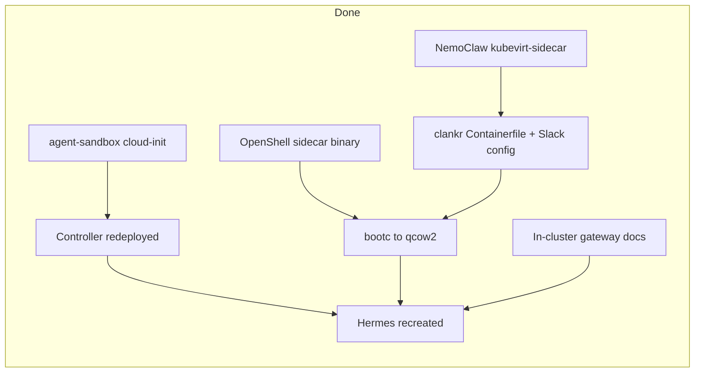

# KubeVirt VM Hermes: Handoff + Bake Results

> **Read this first if you have no context.** This is the living handoff for running Hermes (NemoClaw) as a KubeVirt VM on CRC via OpenShell’s kubernetes driver + agent-sandbox `runtimeBackend: VirtualMachine`. Last updated **2026-07-11**.

## Current state (2026-07-11) — start here

### Goal of the latest work

Persist `/sandbox` across VM reboots using a PVC (not tmpfs). Pods already got a workspace PVC from the OpenShell k8s driver; the **VM path skipped it**. Fix lives on the fork branches below (no upstream PRs yet).

### Branches (compare vs upstream `main`)

| Upstream | Fork branch | Compare |
|----------|-------------|---------|
| [`kubernetes-sigs/agent-sandbox`](https://github.com/kubernetes-sigs/agent-sandbox) | [`shanemcd/agent-sandbox` `kubevirt-backend`](https://github.com/shanemcd/agent-sandbox/tree/kubevirt-backend) | [compare](https://github.com/kubernetes-sigs/agent-sandbox/compare/main...shanemcd:agent-sandbox:kubevirt-backend) |
| [`NVIDIA/OpenShell`](https://github.com/NVIDIA/OpenShell) | [`shanemcd/OpenShell` `kubevirt-sidecar`](https://github.com/shanemcd/OpenShell/tree/kubevirt-sidecar) | [compare](https://github.com/NVIDIA/OpenShell/compare/main...shanemcd:OpenShell:kubevirt-sidecar) |
| [`NVIDIA/NemoClaw`](https://github.com/NVIDIA/NemoClaw) | [`shanemcd/NemoClaw` `kubevirt-sidecar`](https://github.com/shanemcd/NemoClaw/tree/kubevirt-sidecar) | [compare](https://github.com/NVIDIA/NemoClaw/compare/main...shanemcd:NemoClaw:kubevirt-sidecar) |
| — | [`shanemcd/clankr` `main`](https://github.com/shanemcd/clankr) (Hermes bootc image/config + this doc; no fork/upstream split) | [repo](https://github.com/shanemcd/clankr) |

Local clones (clean checkouts of the fork branches above):

| Clone | Branch | Remotes |
|-------|--------|---------|
| `/home/shanemcd/github/kubernetes-sigs/agent-sandbox` | `kubevirt-backend` → `fork/kubevirt-backend` | `origin`=sigs, `fork`=shanemcd |
| `/home/shanemcd/github/clankrshq/OpenShell` | `kubevirt-sidecar` → `fork/kubevirt-sidecar` | `origin`=NVIDIA, `fork`=shanemcd |
| `/home/shanemcd/github/shanemcd/NemoClaw` | `kubevirt-sidecar` → `fork/kubevirt-sidecar` | `upstream`=NVIDIA, `fork`=shanemcd |
| `/home/shanemcd/github/shanemcd/clankr` | `main` → `origin/main` | `origin`=shanemcd/clankr |

### What works on CRC right now

| Thing | Status |
|-------|--------|
| CRC OpenShift | Up; `oc` as `kubeadmin` via `~/.crc/machines/crc/kubeconfig` |
| Gateway `openshell-0` | **Ready 1/1**. Image pinned to Fedora 44 digest `@sha256:f0a8e2a7…` |
| Gateway config | `runtime_backend = "VirtualMachine"`, `sandbox_command = "/usr/local/bin/nemoclaw-start-vm"`, **`workspace_persistence = true`** |
| agent-sandbox controller | Running `:kubevirt` image with virtio-PVC + prepare-script changes |
| Hermes Sandbox / VMI | `default/hermes` Ready / Running; VMI disk `workspace serial=workspace` |
| PVC `workspace-hermes` | Bound (199Gi hostpath) |
| Host CLI | Must use `OPENSHELL_GATEWAY=crc` — **not** local `tot` quadlets |

Hermes currently has `volumeClaimTemplates` + `/sandbox` mount on the Sandbox CR, but that was applied with a **manual `kubectl` patch** before the new gateway binary was healthy. **End-to-end “create sandbox → driver emits VCT → controller attaches virtio → guest mounts PVC” is not yet proven** by deleting and recreating Hermes with only the new gateway.

### Next action (highest priority)

1. Confirm guest `/sandbox` is the PVC (not tmpfs):  
   `virtctl ssh sandbox@vmi/hermes -n default --local-ssh-opts='-oStrictHostKeyChecking=no' --command='findmnt /sandbox; ls -la /dev/disk/by-id/virtio-workspace; test -f /sandbox/.workspace-initialized && echo seeded'`
2. Delete Hermes and recreate via OpenShell CLI **only** (`OPENSHELL_GATEWAY=crc`, no CR patches). Assert Sandbox CR already has `workspace` VCT + mount; PVC binds; guest mounts as above; Slack/inference still work.
3. Open upstream PRs from the compare links above when ready.

### Gateway image rebuild gotchas (painful; do not repeat)

Distroless `Dockerfile.gateway` expects a **glibc 2.28–floor** binary from `cargo zigbuild` via `tasks/scripts/stage-prebuilt-binaries.sh` (auto-enables `bundled-z3`). Local CRC shortcut that works:

1. Build in **Fedora 44 toolbox** with `--features bundled-z3` (no dynamic `libz3`).
2. Package with **`FROM registry.fedoraproject.org/fedora:44`** (same libstdc++ as the build host). Distroless fails with `GLIBCXX_3.4.35 not found` if you copy a native Fedora binary in.
3. Push to `default-route-openshift-image-registry.apps-crc.testing/openshell/openshell-gateway:dev`.
4. **Pin the StatefulSet image to the new digest** (tag alone can leave the pod on an old digest). `imagePullPolicy: Always`.
5. Never put unknown TOML keys in the ConfigMap before the binary that understands them is running — serde rejects unknown fields → crash loop.

Proper long-term path: install `cargo-zigbuild` + zig / use `mise run` staging so distroless works again.

---

## Summary (history)

KubeVirt VM support for the agent-sandbox controller so Hermes (NemoClaw) runs in a VM instead of a Pod. Full gateway integration works.

**As of 2026-07-10 (evening) — BAKE COMPLETE:** Initial two-service sidecar topology verified (Slack Socket Mode + Vertex inference). Primary contact channel is **Slack**. Discord disabled in image. Signal deferred (SSRF).

**As of 2026-07-10 (process mode) — SINGLE SUPERVISOR:** Re-enabled OpenShell `--mode=network,process` via `OPENSHELL_PRESERVE_SANDBOX_OWNERSHIP=1` (skips recursive `/sandbox` chown that smashed NemoClaw seals). Hermes runs as the Landlock'd non-root child of `openshell-sandbox`. No `sandbox-workload` unit.

**As of 2026-07-10 (late) — BRANCHES ON FORKS:** Controller + OpenShell sidecar work pushed to `shanemcd` forks (no upstream PRs yet). Early standalone `openshell-driver-kubevirt` POC dropped from the OpenShell branch; approach is an option on the existing Kubernetes driver + process+network sidecar runtime.

**As of 2026-07-10 (cleanup) — LEAN IMAGE + NEMOCLAW BRANCH:** In-image sed/python patches removed. VM/sibling-supervisor support lives on [`shanemcd/NemoClaw` `kubevirt-sidecar`](https://github.com/shanemcd/NemoClaw/tree/kubevirt-sidecar) (`NEMOCLAW_VM_SIDECAR=1` / `nemoclaw-start-vm`). Bootc image is Hermes + ddgs only (no rust, build toolchain, or extra CLIs).

**As of 2026-07-10 (late) — HERMES ≥0.18 INFERENCE FIX:** `provider: anthropic` + `base_url: https://inference.local` is ignored by Hermes (`_anthropic_base_url_override_ok`); it falls back to `api.anthropic.com` (DENIED by OpenShell). Live config must use `provider: custom`, `base_url: https://inference.local`, `api_key: sk-OPENSHELL-PROXY-REWRITE`, `api_mode: anthropic_messages`. Hot-fixing config/`.env` requires regenerating hashes in **sha256sum format** via `update-config-hashes.py` (wrong format crash-loops with `Config integrity check FAILED`).

**As of 2026-07-10 (night) — CLI WAS HITTING LOCAL KUBEVIRT STACK:** `openshell sandbox create` failures (`Pending: VMI phase: Pending` → immediate Error) were **not** the agent-sandbox controller. Host CLI was talking to local Podman quadlets (`openshell-gateway` + `openshell-driver-kubevirt`) via `OPENSHELL_GATEWAY_ENDPOINT=https://tot:8080`, which create VMs/Secrets directly and skip the Sandbox CR. Fixed: register/use gateway `crc` → `https://openshell-openshell.apps-crc.testing` (mTLS, `is_remote: true`); unset the endpoint override; **mask** the local quadlets. In-cluster gateway already uses `[openshell.drivers.kubernetes]` + `runtime_backend = "VirtualMachine"`.

**As of 2026-07-10 (night) — TMPFS OVERLAY EVERY BOOT:** cloud-init `runcmd` only runs on first boot, so after reboot `/sandbox` was immutable `root:root` again → `HERMES_RESTART_SEAL_ORPHANED` / OpenShell `Provisioning`. Fix: `openshell-sandbox-prepare.service` (oneshot) runs `/etc/openshell/prepare-writable-roots.sh` before `openshell-sandbox` every boot (`Requires=` + `WantedBy=`). In `agent-sandbox` controller cloud-init; live Hermes hot-patched.

**As of 2026-07-10/11 — WORKSPACE PVC FOR VMs:** agent-sandbox maps Sandbox `volumeClaimTemplates` + first-container `volumeMounts` to KubeVirt virtio disks (`serial`, PVC `claimName: <name>-<sandbox>`). Guest prepare script waits for `/dev/disk/by-id/virtio-<serial>`, `mkfs.ext4` if empty, mounts, seeds from image using `.workspace-initialized`, skips tmpfs for PVC paths, sets `kernel.printk = 3 4 1 7`. OpenShell adds `workspace_persistence` (default `true`; env `OPENSHELL_K8S_WORKSPACE_PERSISTENCE`; Helm `server.workspacePersistence`) and emits the workspace VCT/mount for **both** Pod and VM paths when enabled.

## Repositories involved

| Repo | Fork / branch | Compare vs `main` | What changed |
|------|---------------|-------------------|--------------|
| `kubernetes-sigs/agent-sandbox` | [`kubevirt-backend`](https://github.com/shanemcd/agent-sandbox/tree/kubevirt-backend) | [compare](https://github.com/kubernetes-sigs/agent-sandbox/compare/main...shanemcd:agent-sandbox:kubevirt-backend) | `runtimeBackend: VirtualMachine`, cloud-init single supervisor, VCT→virtio disks + prepare-script PVC mount/seed |
| `NVIDIA/OpenShell` | [`kubevirt-sidecar`](https://github.com/shanemcd/OpenShell/tree/kubevirt-sidecar) | [compare](https://github.com/NVIDIA/OpenShell/compare/main...shanemcd:OpenShell:kubevirt-sidecar) | Sidecar runtime, preserve-ownership, k8s `runtimeBackend` / `sandboxCommand`, `workspace_persistence` |
| `NVIDIA/NemoClaw` | [`kubevirt-sidecar`](https://github.com/shanemcd/NemoClaw/tree/kubevirt-sidecar) | [compare](https://github.com/NVIDIA/NemoClaw/compare/main...shanemcd:NemoClaw:kubevirt-sidecar) | OpenShell-supervised identity (sibling **or parent**) + `nemoclaw-start-vm` (`NEMOCLAW_VM_SIDECAR=1`) |
| `shanemcd/clankr` | [`main`](https://github.com/shanemcd/clankr) | — | Lean `Containerfile.kubevirt` (Hermes+ddgs), Slack-only config, this doc |

## Bake outcomes (2026-07-10 evening)

| Layer | Result |
|-------|--------|
| OpenShell `sidecar_runtime` + preserve-ownership | Baked into Hermes disk; source on fork branch `kubevirt-sidecar` |
| agent-sandbox cloud-init | Single supervisor (`network,process`) on CRC; source on fork `kubevirt-backend` |
| NemoClaw VM entrypoint | `nemoclaw-start-vm` from `shanemcd/NemoClaw` `kubevirt-sidecar` (no Containerfile patches) |
| clankr bootc disk | Hermes + ddgs only; Slack-only config; `usermod -aG sandbox gateway` |
| Live Hermes VM | Lean recreate + hot-fix: Slack Socket Mode; model `custom`→`inference.local`; **no `/tmp` hot-patches** |
| Gateway docs | In-cluster bootstrap in `PROVIDERS.md`, `KUBEVIRT_POC.md`, this doc |



## Architecture

### How it works in containers (the reference)

```
Pod:
  nemoclaw-start (PID 1, root)          ← container entrypoint
    └─ sets up configs, ownership
    └─ creates 'gateway' user
    └─ drops to sandbox user
    └─ runs hermes gateway

  openshell-sandbox (sidecar container)  ← separate process
    └─ creates netns + proxy
    └─ SSH relay
    └─ does NOT manage nemoclaw's process
```

Key point: the supervisor and nemoclaw-start are **peers**, not parent-child. The supervisor never touches `/sandbox` or runs `nemoclaw-start`.

### How it works in the VM (baked)

```
VM (systemd):
  openshell-sandbox                      ← default --mode=network,process
    Environment=OPENSHELL_SANDBOX_COMMAND=/usr/local/bin/nemoclaw-start-vm
    Environment=OPENSHELL_PRESERVE_SANDBOX_OWNERSHIP=1
    └─ creates netns + proxy at 10.200.0.1:3128
    └─ prepares FS but skips recursive /sandbox chown (preserve seals)
    └─ forks Landlock/seccomp child as sandbox (UID 10001)
         └─ nemoclaw-start-vm (NEMOCLAW_VM_SIDECAR=1, non-root path)
              └─ hermes gateway run
```

cloud-init runcmd still applies tmpfs overlays, `root:sandbox 1775` on `/sandbox`, and re-locks `.hermes` trust anchors **before** the supervisor starts.

Earlier two-service (`--mode=network` + `sandbox-workload`) existed because combined mode's recursive chown smashed `root:root` seals. `OPENSHELL_PRESERVE_SANDBOX_OWNERSHIP=1` removes that need; Landlock applies to Hermes again.

### Where credentials live (important)

The OpenShell **gateway is not on the VM**. Secrets live in the gateway object store. The VM only sees placeholders; the supervisor proxy rewrites them at egress.

| Gateway | Endpoint | Role |
|---------|----------|------|
| **In-cluster** (CRC) | Cluster: `https://openshell.openshell.svc.cluster.local:8080`<br>Host CLI: `https://openshell-openshell.apps-crc.testing` (gateway name `crc`, mTLS) | Credential + inference store; kubernetes driver → Sandbox CR |
| **Local quadlets** (host) | `https://tot:8080` / `0.0.0.0:8080` | `openshell-gateway` + `openshell-driver-kubevirt` systemd units — **separate store**, creates VMs directly, **do not use** for Hermes |

These are **separate stores**. Configuring providers/inference on `tot` / local quadlets does **not** affect the VM. Always target the in-cluster gateway from the host:

```bash
# Preferred: registered gateway (see ~/.config/openshell/gateways/crc/)
export OPENSHELL_GATEWAY=crc
# Do NOT set OPENSHELL_GATEWAY_ENDPOINT=https://tot:8080 — it overrides metadata

openshell provider list
openshell inference get

# Fallback if route/mTLS is broken:
oc port-forward -n openshell svc/openshell 18080:8080
openshell provider list --gateway-endpoint http://127.0.0.1:18080
```

**Local quadlets** live at `~/.config/containers/systemd/openshell-{gateway,driver-kubevirt}.container` (`WantedBy=default.target`). Mask when using CRC:

```bash
systemctl --user stop openshell-gateway.service openshell-driver-kubevirt.service
systemctl --user mask openshell-gateway.service openshell-driver-kubevirt.service
```

## Root cause analysis (2026-07-10)

### Morning: proxy / entrypoint identity

| Suspected issue | Actual finding |
|-----------------|----------------|
| Proxy unreachable from netns | Proxy **was** reachable (`curl` → 400 from inside netns) |
| Stale netns from `ls -t` | Real, but not the blocker once `/run/openshell/netns` is published |
| Missing `http_proxy` | Env was already set by nemoclaw-start |
| Credential placeholders not in `.env` | **Real** — tokens are injected into **process env**, not baked into `.env`. Network-only mode never spawned a child |
| Platforms fail with 403 | **Real** — `entrypoint process not yet spawned`; identity binding needs a PID **inside the sandbox netns** |

**Fix:** OpenShell `--mode=network` publishes `/run/openshell/{netns,provider.env}`, watches `entrypoint.pid`; workload sources them, trusts MITM CA, enters netns, writes PID. (Morning used `/tmp/openshell-sandbox.new`; now baked into the image.)

### Afternoon: Slack up, inference 503

```text
HTTP 503: {'error': 'cluster inference is not configured',
           'hint': 'run: openshell cluster inference set --help'}
```

| Suspected issue | Actual finding |
|-----------------|----------------|
| Inference not set at all | Set on **`tot` only** |
| VM gateway missing routes | Supervisor fetched `route_count:0` from **in-cluster** gateway |
| Wrong Vertex project | ADC `quota_project_id` wrong; correct is `itpc-gcp-hcm-pe-eng-claude` |

**Fix (in-cluster gateway via port-forward):**

```bash
oc port-forward -n openshell svc/openshell 18080:8080

openshell provider create --gateway-endpoint http://127.0.0.1:18080 \
  --name vertex-prod --type google-vertex-ai --from-gcloud-adc \
  --config VERTEX_AI_PROJECT_ID=itpc-gcp-hcm-pe-eng-claude \
  --config VERTEX_AI_REGION=global

openshell inference set --gateway-endpoint http://127.0.0.1:18080 \
  --provider vertex-prod --model claude-opus-4-6
```

### Evening bake lessons

1. **entrypoint.pid `$$`**: use wrapper under `/etc/openshell/` (bootc `/usr` is read-only; systemd `$` escaping is fragile)
2. **`/sandbox` root:root after tmpfs**: NemoClaw treats this as an orphaned seal — re-`chown root:sandbox` + `chmod 1775`
3. **bootc UID remap**: normalize `.hermes` mutable trees to `sandbox:sandbox`, re-lock trust anchors (`config.yaml`, `.config-hash`, `SOUL.md`)
4. **gateway ∈ sandbox group** required to read `.env` / locks (`usermod -aG sandbox gateway`)
5. **first-boot Slack race**: source `provider.env` in the wrapper; don't rely only on systemd `EnvironmentFile` timing

### Operational footgun: NemoClaw config hashes

Editing `/sandbox/.hermes/config.yaml` or `.env` on the live VM **without** regenerating hashes crash-loops the workload (`Config integrity check FAILED` / `HERMES_MCP_CONFIG_DRIFT`). Use `update-config-hashes.py` (both `/sandbox/.hermes/.config-hash` and `/etc/nemoclaw/hermes.config-hash`) — format is `sha256sum` lines (`<digest>  <abs-path>`), not `config: <digest>`. Prefer baking changes into the image.

### Operational footgun: Hermes ≥0.18 + OpenShell inference

Do **not** set `model.provider: anthropic` with `base_url: https://inference.local`. Hermes drops the override and calls `api.anthropic.com`, which OpenShell denies → Slack “model provider failed after retries”. Use `provider: custom` + `api_mode: anthropic_messages` + literal `sk-OPENSHELL-PROXY-REWRITE` (see `hermes-config.py` / `hermes.env`).

Also clear `providers` / `custom_providers` entries named `custom`. A leftover block (e.g. Nemotron + `chat_completions`) hijacks `resolve_runtime_provider()` and ignores `model.api_mode`, producing `POST /v1/chat/completions` / `/api/show` instead of `/v1/messages` → `no compatible inference route available`.

### Night: create failed with `Pending: VMI phase: Pending`

| Suspected issue | Actual finding |
|-----------------|----------------|
| Controller marks Ready reason=`Pending` as terminal | Controller correctly uses `DependenciesNotReady` + `VMI phase: …` |
| In-cluster gateway broken | In-cluster was fine (`openshell_driver_kubernetes`); **no CreateSandbox** in its logs |
| Wrong image / disk | Secondary — community `base` is not a containerdisk (`…/merged/disk: no such file`) |
| CLI → wrong gateway | **Real** — `OPENSHELL_GATEWAY_ENDPOINT=https://tot:8080` + local kubevirt driver; Ready condition used `reason: phase` (`Pending`) → gateway treated as terminal Error |

**Fix:** point CLI at `crc` (route + mTLS), mask local quadlets, create with Hermes containerdisk (`hermes-sandbox-kubevirt:latest`), not `ghcr.io/nvidia/openshell-community/sandboxes/base:latest`.

## Current live outcomes

| Platform / path | Status | Notes |
|-----------------|--------|-------|
| Host CLI → in-cluster gateway | **Working** | `OPENSHELL_GATEWAY=crc`; local quadlets masked; creates → Sandbox CR |
| Gateway pod | **Ready** | Fedora 44 image + bundled-z3; digest-pinned STS |
| Workspace PVC path | **Partial** | Live Hermes has PVC + virtio disk (manual patch provenance); driver auto-inject **unverified** |
| Slack | **Was working** | Socket Mode through proxy; re-verify after clean Hermes recreate |
| Inference (`inference.local`) | **Was working** | `provider: custom` + `api_mode: anthropic_messages`; in-cluster `vertex-prod` → Claude Opus |
| Discord | **Disabled** in image | Token rotation is separate if re-enabled |
| Signal | **Deferred** | SSRF rejects `host.containers.internal` |
| Atlassian MCP | ALLOWED | Proxy allows |
| GitHub | ALLOWED | Downloads work through proxy |

## Still open

#### Prove workspace PVC end-to-end (next)

Hermes already has a Bound `workspace-hermes` PVC and a virtio `workspace` disk, but the CR was **manually patched**. Recreate without patches:

```bash
export OPENSHELL_GATEWAY=crc
unset OPENSHELL_GATEWAY_ENDPOINT
# destroy existing sandbox via openshell CLI (or oc delete sandbox/vm/vmi/pvc as needed)
openshell sandbox create …   # same Hermes image / name as before
oc -n default get sandbox hermes -o yaml | rg -A20 'volumeClaimTemplates|volumeMounts|runtimeBackend'
oc -n default get pvc workspace-hermes
virtctl ssh sandbox@vmi/hermes -n default --local-ssh-opts='-oStrictHostKeyChecking=no' \
  --command='findmnt /sandbox; cat /proc/mounts | grep sandbox'
```

Expect: driver-emitted VCT; PVC Bound; `/sandbox` on `/dev/vdc` (or similar) ext4 with `.workspace-initialized`; survives reboot without seal orphan errors.

#### Signal on VMs (deferred)

`SIGNAL_HTTP_URL=http://host.containers.internal:8081` is Podman-specific and blocked by OpenShell SSRF. Point Signal at a routable signal-cli endpoint (or run signal-cli in-cluster).

#### Discord token (low priority)

Not a VM wiring bug. Image disables Discord. Rotate `DISCORD_BOT_TOKEN` on the **in-cluster** gateway only if Discord is re-enabled.

#### Commits / PRs

| Repo | Status |
|------|--------|
| agent-sandbox | Fork branch [`kubevirt-backend`](https://github.com/shanemcd/agent-sandbox/tree/kubevirt-backend) includes VM backend + VCT→virtio. [Compare → upstream main](https://github.com/kubernetes-sigs/agent-sandbox/compare/main...shanemcd:agent-sandbox:kubevirt-backend). **No upstream PR yet.** |
| OpenShell | Fork branch [`kubevirt-sidecar`](https://github.com/shanemcd/OpenShell/tree/kubevirt-sidecar) includes sidecar + `workspace_persistence`. [Compare → upstream main](https://github.com/NVIDIA/OpenShell/compare/main...shanemcd:OpenShell:kubevirt-sidecar). **No upstream PR yet.** Discard `kubevirt-driver` (standalone POC). |
| NemoClaw | Fork branch [`kubevirt-sidecar`](https://github.com/shanemcd/NemoClaw/tree/kubevirt-sidecar). [Compare → upstream main](https://github.com/NVIDIA/NemoClaw/compare/main...shanemcd:NemoClaw:kubevirt-sidecar). **No upstream PR yet.** |
| clankr | [`shanemcd/clankr` `main`](https://github.com/shanemcd/clankr) — lean image/config/docs. |

Local clones: OpenShell remotes should be `origin=NVIDIA/OpenShell`, `fork=shanemcd/OpenShell` (clone often under `/home/shanemcd/github/clankrshq/OpenShell`). NemoClaw: `upstream=NVIDIA/NemoClaw`, `fork=shanemcd/NemoClaw`. agent-sandbox: `origin=kubernetes-sigs/agent-sandbox`, `fork=shanemcd/agent-sandbox`.

## Workspace PVC design (2026-07-10/11)

```
OpenShell k8s driver (workspace_persistence=true)
  → Sandbox CR:
       runtimeBackend: VirtualMachine
       volumeClaimTemplates: [{ name: workspace, 10Gi, RWO }]
       containers[0].volumeMounts: [{ name: workspace, mountPath: /sandbox }]

agent-sandbox controller
  → reconcilePVCs → PVC workspace-<sandboxName>
  → KubeVirt VM disks/volumes: virtio disk serial=<alphanumeric name>, claimName=workspace-<sandbox>
  → cloud-init prepare-writable-roots.sh every boot:
       wait /dev/disk/by-id/virtio-<serial>
       mkfs.ext4 if blank → mount → seed from image if no .workspace-initialized
       skip tmpfs overlay for PVC mount paths
```

Key code:

- agent-sandbox: `collectVMVolumeMounts`, `appendVMClaimDisks`, `virtioDiskSerial`, `buildPrepareWritableRootsScript` in `controllers/sandbox_controller.go`
- OpenShell: `workspace_persistence` on k8s driver config; `sandbox_to_k8s_spec_vm` + Pod `apply_workspace_persistence` gated on the same flag; unit tests `workspace_*` in `driver.rs`

OpenShell CLI has **no** volume flag — persistence is gateway/driver config only.

## Code changes

### `NVIDIA/OpenShell` → fork branch `kubevirt-sidecar`

**New:** `crates/openshell-sandbox/src/sidecar_runtime.rs`
- Publishes `/run/openshell/netns` + `provider.env`
- Watches `/run/openshell/entrypoint.pid` → `entrypoint_pid` AtomicU32
- Refreshes `provider.env` when credentials rotate

**`crates/openshell-sandbox/src/lib.rs`:** wires sidecar publish + watcher in network-only mode.

**`openshell-driver-kubernetes`:** `runtimeBackend` / `sandboxCommand` (extend existing K8s driver — **not** a new `openshell-driver-kubevirt` binary). Also `workspace_persistence` (default true) for Pod + VM.

Helm `gateway-config` keys for the above (including `workspacePersistence`).

> Early POC that added a standalone `openshell-driver-kubevirt` crate lived on `kubevirt-driver` and was intentionally left off `kubevirt-sidecar`.

### `kubernetes-sigs/agent-sandbox` → fork branch `kubevirt-backend`

**API:** `runtimeBackend` on `SandboxBlueprint` (`Pod` \| `VirtualMachine`).

**`controllers/sandbox_controller.go`** (process-mode / single supervisor):
- Supervisor: `--mode=network,process` with `OPENSHELL_SANDBOX_COMMAND` + `OPENSHELL_PRESERVE_SANDBOX_OWNERSHIP=1`
- No separate `sandbox-workload` unit when preserve-ownership path is used
- tmpfs overlays for `/sandbox` / `/opt/data` + ownership normalize before supervisor start
- Ready condition while VMI is pending: `DependenciesNotReady` + `VMI phase: …` (not reason=`Pending`)
- VCT → virtio disks; prepare script PVC mount/seed; printk quieting

CRDs regenerated with `make fix-go-generate` (conversion webhook via `sort-crd-versions`).

### `NVIDIA/NemoClaw` → fork branch `kubevirt-sidecar`

**`agents/hermes/runtime-config-guard.py`:** when `NEMOCLAW_VM_SIDECAR=1`, accept sibling `openshell-sandbox` identity and skip PID-1 readiness proofs.

**`agents/hermes/validate-env-secret-boundary.py`:** same gate for env-file / runtime-env checks.

**`agents/hermes/start.sh` + `start-vm.sh`:** skip Landlock-hostile `tee` redirects; set `NEMOCLAW_CAPS_DROPPED`; put `/opt/hermes/.venv/bin` on PATH. Wrapper installs as `/usr/local/bin/nemoclaw-start-vm`.

### `shanemcd/clankr` (`main`)

**`Containerfile.kubevirt`:** `FROM localhost/nemoclaw-hermes:kubevirt` (built via `build-nemoclaw-hermes-kubevirt.sh`); COPY OpenShell `openshell-sandbox`; Hermes + **ddgs only**; Slack-only overlay; no rust/CLIs/patches.
**Slack-focused config:** `hermes-config.py`, `hermes.env` / `.example`, `policy.yaml` / `.example`, `SOUL.md`, `PROVIDERS.md`.

## CRC deployment state

| Component | Namespace | Image | Notes |
|-----------|-----------|-------|-------|
| Agent-sandbox controller | `agent-sandbox-system` | `…/agent-sandbox-controller:kubevirt` | Includes virtio-PVC prepare path (redeployed ~13h ago) |
| OpenShell gateway | `openshell` | `…/openshell-gateway@sha256:f0a8e2a7…` (**Fedora 44** base, bundled-z3) | STS image **digest-pinned**; `workspace_persistence = true` |
| Host CLI gateway | (registration `crc`) | Route `openshell-openshell.apps-crc.testing` | mTLS; `is_remote: true`; `OPENSHELL_GATEWAY=crc` |
| Local quadlets | (host systemd) | `openshell-gateway:kubevirt` + kubevirt driver | **Masked** — do not run alongside CRC Hermes work |
| Live supervisor binary | (on VM) | `/opt/openshell/bin/openshell-sandbox` | Baked sidecar binary (no `/tmp` patch) |
| Hermes containerDisk | `openshell-sandboxes` | `hermes-sandbox-kubevirt:latest` | Rebuilt evening of 2026-07-10 |
| Hermes VMI | `default` | `hermes` | Running; workspace virtio disk present (manual VCT provenance) |
| Workspace PVC | `default` | `workspace-hermes` | Bound |

**In-cluster gateway config (effective):** TLS + client CA mounted; `allow_unauthenticated_users = true`; `[openshell.drivers.kubernetes]` with `runtime_backend = "VirtualMachine"`, `sandbox_command = "/usr/local/bin/nemoclaw-start-vm"`, `workspace_persistence = true`, `sandbox_namespace = "default"`. Route termination: **passthrough**.

**Helm-shaped values (reference):**
```
server.auth.allowUnauthenticatedUsers=true
server.sandboxNamespace=default
server.logLevel=debug
server.runtimeBackend=VirtualMachine
server.sandboxCommand=/usr/local/bin/nemoclaw-start-vm
server.workspacePersistence=true
# TLS enabled in-cluster (passthrough Route); do not assume disableTls=true
```

**In-cluster providers:** github, atlassian, slack, **vertex-prod** (discord may still exist in store but image disables the platform). Inference: `vertex-prod` / `claude-opus-4-6`.

### Rebuild / redeploy gateway (CRC local)

```bash
# Inside fedora-toolbox-44 (or host Fedora 44):
cd /home/shanemcd/github/clankrshq/OpenShell
cargo build -p openshell-server --release --bin openshell-gateway --features bundled-z3
mkdir -p deploy/docker/.build/prebuilt-binaries/amd64
cp -f target/release/openshell-gateway deploy/docker/.build/prebuilt-binaries/amd64/

# One-off Fedora 44 runtime (matches toolbox libstdc++; NOT upstream Dockerfile.gateway):
podman build -f - -t openshell-gateway:dev . <<'EOF'
FROM registry.fedoraproject.org/fedora:44
COPY deploy/docker/.build/prebuilt-binaries/amd64/openshell-gateway /usr/local/bin/openshell-gateway
RUN useradd -u 1000 -m -s /sbin/nologin openshell
USER 1000:1000
EXPOSE 8080
ENTRYPOINT ["/usr/local/bin/openshell-gateway"]
CMD ["--bind-address", "0.0.0.0", "--port", "8080"]
EOF

REG=default-route-openshift-image-registry.apps-crc.testing
podman login -u kubeadmin -p "$(oc whoami -t)" "$REG" --tls-verify=false
podman tag openshell-gateway:dev "$REG/openshell/openshell-gateway:dev"
podman push --tls-verify=false "$REG/openshell/openshell-gateway:dev"
# Then pin STS to the new ImageStream digest and delete pod openshell-0
```

### Rebuild / redeploy agent-sandbox controller

Build/push `agent-sandbox-controller:kubevirt` to the CRC registry (prior session used image registry NS `agent-sandbox-system`). After Go changes in `controllers/`, redeploy Deployment `agent-sandbox-system/agent-sandbox-controller`. Use toolbox for Go if host tools are missing: `podman exec -u 1000 -e HOME=/var/home/shanemcd fedora-toolbox-44 …`.

## Sidecar coordination contract

```
/run/openshell/netns            # absolute path, e.g. /run/netns/sandbox-abcd1234
/run/openshell/provider.env     # KEY=openshell:resolve:env:vNNN_KEY (mode 0644)
/run/openshell/entrypoint.pid   # child PID in sandbox netns (process mode)
/etc/openshell-tls/ca-bundle.pem
/etc/openshell-tls/openshell-ca.pem
```

Process mode injects provider placeholders + proxy/TLS env into the child. cloud-init sets `OPENSHELL_PRESERVE_SANDBOX_OWNERSHIP=1` so sealed trust anchors stay `root:root`.

## Debugging tips

```bash
# VM
virtctl ssh sandbox@vmi/hermes -n default --local-ssh-opts="-oStrictHostKeyChecking=no" --command='...'
sudo systemctl status openshell-sandbox
# Expect: no sandbox-workload unit
sudo cat /run/openshell/netns /run/openshell/entrypoint.pid
sudo cut -d= -f1 /run/openshell/provider.env
findmnt /sandbox; ls -la /dev/disk/by-id/virtio-workspace
sudo journalctl -u openshell-sandbox.service --no-pager -n 80 \
  | grep -E 'Preserving sandbox ownership|Published sidecar|DENIED|ALLOWED|route_count|Inference|Landlock|slack|✓'
sudo journalctl -u openshell-sandbox-prepare.service --no-pager -n 40

# In-cluster gateway (not tot / not local quadlets!)
export OPENSHELL_GATEWAY=crc
unset OPENSHELL_GATEWAY_ENDPOINT
openshell gateway info          # expect openshell-openshell.apps-crc.testing
openshell inference get
openshell provider list
# Confirm creates hit k8s driver: oc logs -n openshell openshell-0 | grep 'Creating sandbox in Kubernetes'

# Inference probe from sandbox netns (via proxy)
sudo nsenter --net=$(cat /run/openshell/netns) env \
  http_proxy=http://10.200.0.1:3128 https_proxy=http://10.200.0.1:3128 \
  SSL_CERT_FILE=/etc/openshell-tls/ca-bundle.pem \
  curl -sS https://inference.local/v1/messages ...
```

## Key design decisions

| Decision | Rationale |
|----------|-----------|
| `OPENSHELL_PRESERVE_SANDBOX_OWNERSHIP=1` | Skips recursive `/sandbox` chown so `root:root` seals survive process mode |
| Single supervisor (`network,process`) | Landlock/seccomp apply to Hermes; netns + proxy stay in the same binary |
| provider.env / process env (not .env mutation) | Mutating `.env` breaks NemoClaw config hashes |
| Guard via `NEMOCLAW_VM_SIDECAR` | Supervisor may be sibling or parent; stock container proofs stay unchanged |
| bootc + bootc-image-builder | Fast layer-cached builds; Fedora 44 base; NoCloud datasource added manually |
| Configure inference on in-cluster gateway | VM supervisor never talks to host-local `tot`; separate credential stores |
| Host CLI → gateway `crc` (route + mTLS) | `OPENSHELL_GATEWAY_ENDPOINT` / local kubevirt quadlets bypass Sandbox CR and poison debugging |
| Mask local OpenShell quadlets during CRC work | Units auto-start via `WantedBy=default.target` and bind `:8080` |
| PVC for `/sandbox` (not only tmpfs) | Tmpfs is per-boot ephemeral; workspace needs durable agent state |
| Virtio serial = sanitized volume name | KubeVirt disk serial ≤20 alphanumeric; guest finds `/dev/disk/by-id/virtio-<serial>` |
| `workspace_persistence` default true | Match Pod behavior; disable via config/env/Helm when ephemeral is desired |
| Fedora 44 gateway image for local CRC builds | Native toolbox binaries need matching libstdc++; upstream path remains zigbuild→distroless |
